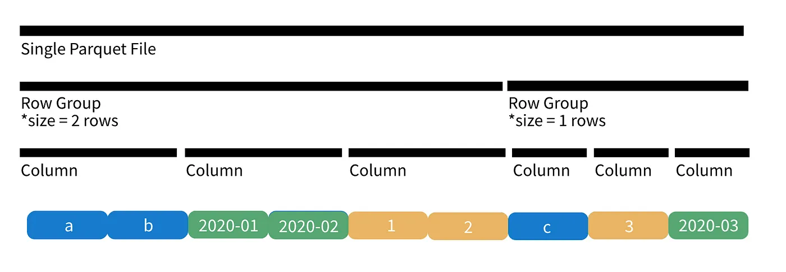
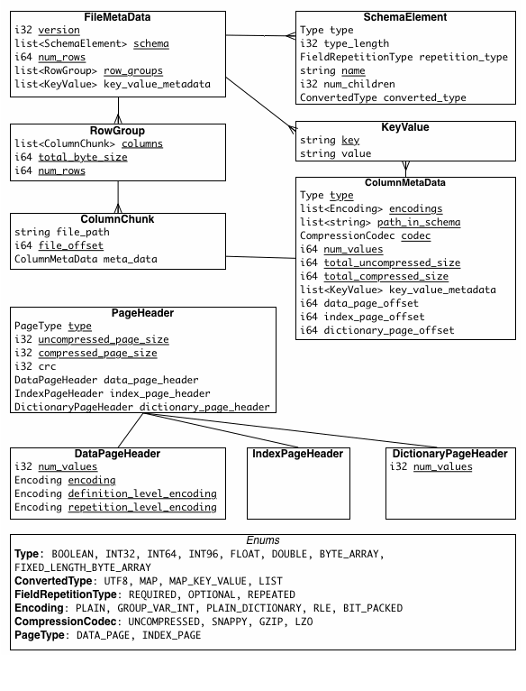
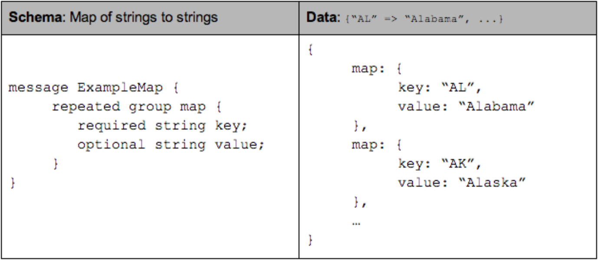
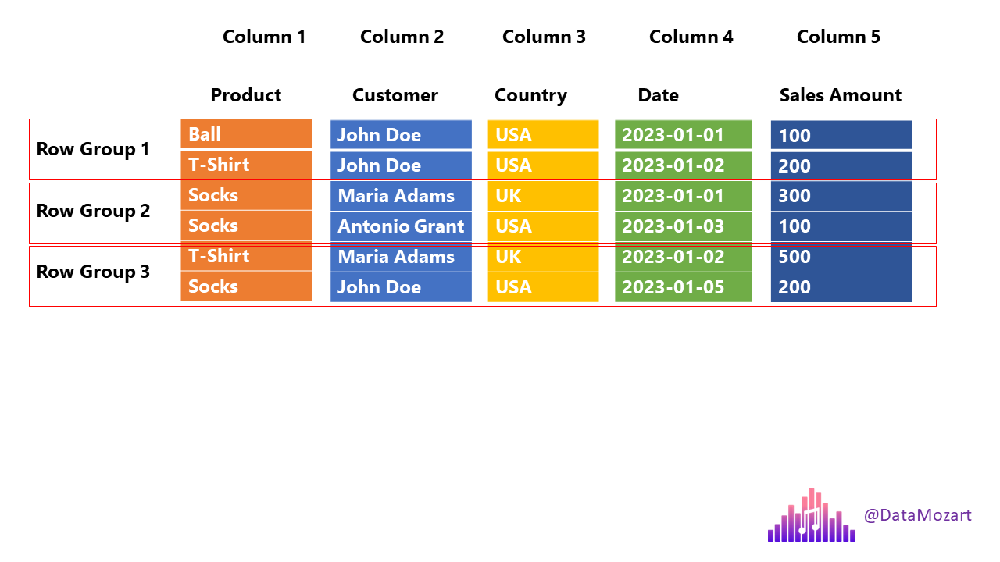

## Intro

As data engineers we work with the Parquet format almost daily - Data are stored in this convenient columnar format that comprises the corner stones of all the foundational data warehouses in organizations. You might have known some of its features and compared it to some of the other popular formats like ORC, or witnesses error messages related to some of the mechanisms of Parquet in Spark UI or driver logs, but with this blog you can grow a better understanding of this familiar yet secretive technology.

## History

Parquet began as a joint effort between Twitter and Cloudera in 2013, and later sponsored by the Apache Software Foundation in 2015[1](https://blog.twitter.com/engineering/en_us/a/2013/announcing-parquet-10-columnar-storage-for-hadoop), pursing the benefits of storage and compression of columnar formats in relational databases.

Parquet is fully compatible with the Hadoop ecosystem but it's intended to be independent of platform, framework, or serialization techniques by design.

The idea is very simple: 
 - To read only the columns that you need, rather than read all the data and chop off the columns you do no need, will save you a significant amount of computational resources.
 - When you store millions of data of the same column of the same type, compression is made easier.

## File Structure
A Parquet file looks like this:

Or a simpler version

 [source](https://towardsdatascience.com/demystifying-the-parquet-file-format-13adb0206705)

A Parquet files starts and end with the 4-byte magic number "PAR1". It's to indicate that the file is of Parquet format and also set the boundaries of a file.

The data block is comprised of multiple consecutive row groups. A row group contains exactly one column chunk per column. Column chunks contain one or more pages. Here are some official definition of the mentioned concepts.

- Row group: A logical horizontal partitioning of the data into rows. There is no physical structure that is guaranteed for a row group. A row group consists of a column chunk for each column in the dataset. A row group literally holds "a group of rows".
- Column chunk: A chunk of the data for a particular column. These live in a particular row group and is guaranteed to be contiguous in the file.
- Page: Column chunks are divided up into pages. A page is conceptually an indivisible unit (in terms of compression and encoding). There can be multiple page types which is interleaved in a column chunk.

The file metadata is stored in the footer. There are three types of metadata: file metadata (version of the format, the schema, any extra key-value pairs), column (chunk) metadata (type, path, encoding, number of values, compressed size, offset of first data & index), and page header metadata. The footer metadata is followed by a 4-byte footer length and the magic number.

The structure of the file metadata is listed here:

## Metadata
### Schema
The schema, a Protobuff-like definition of a message, defines how the data is suppose to be stored. Inside a message there are multiple fields, each having three attributes - repetition, type, and name. The type of a field is either a group (referencing other messages), or a primitive type (int, float, boolean, string).

The repetition can be one of the following three:
- required: exactly one occurrence
- optional: 0 or 1 occurrence
- repeated: 0 or more occurrences

[source](https://blog.twitter.com/engineering/en_us/a/2013/dremel-made-simple-with-parquet)

How are nested structures stored linearly and how are they reconstructed while read? [Twitter's engineering blog](https://blog.twitter.com/engineering/en_us/a/2013/dremel-made-simple-with-parquet) has given an accessible explanation on definition levels and repetition levels. Note that definition & repetition levels are stored alongside with data values in a page.

## Reading a Parquet file 

So with the design laid out, how does Parquet leverages it to make reading Parquet files more efficiently?

We can refer to this illustration made by [Nikola](https://www.linkedin.com/pulse/parquet-file-format-everything-you-need-know-nikola-ilic).

Imagine we have a 6-row dataset with the following schema, and we want to execute a query to select the customer column and the date column of all customers who bought T-shirt.

When the engine meets this parquet file, it will:
    1. Read the length of the footer section to locate the footer from reading backwards.
    2. By reading the statistics of the column metadata (column metadata usually contains the min-max value, value numbers & dictionary of a column), the engine can determine that Row Group 2 has no valid data to read and will only read Row Group 1 and 3.
    3. The engine scans the the row groups and acquired the indexes of rows that are equal to T-shirt (index 1 of Row Group 1 and index 0 of Row Group 3).
    4. The engine acquires the offset of column customer and date of each row group from the metadata, and read using the indices acquired from step3.

Note that this is an oversimplified illustration.

## Compression
TODO

## References

1. [Announcing Parquet 1.0: Columnar Storage for Hadoop](https://blog.twitter.com/engineering/en_us/a/2013/announcing-parquet-10-columnar-storage-for-hadoop)
2. [Apache Parquet Official Documentation](https://parquet.apache.org/docs/)
3. [Dremel made simple with Parquet](https://blog.twitter.com/engineering/en_us/a/2013/dremel-made-simple-with-parquet)
4. [Parquet file format – everything you need to know!](https://www.linkedin.com/pulse/parquet-file-format-everything-you-need-know-nikola-ilic)
5. [Demystifying the Parquet File Format](https://towardsdatascience.com/demystifying-the-parquet-file-format-13adb0206705)