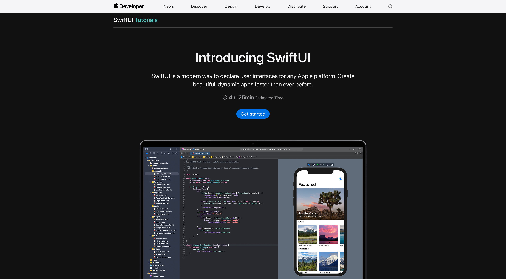

## Intro

This blog documents the journey of learning Swift, including its UI frameworks SwiftUI and UIKit, to build features for Metatext - an open source IOS client for mastodon.

## Why do I want to do this?

Metatext is actually recommended by a friend of mine. It has been an simple and elegant little app on my phone ever since I joined the Fediverse. I feel saddened when the original author announced that he'll stop developing the app due to health issues, thus I emailed him about helping to maintain the project but to this day there's no reply yet. The original git repository was archived on Dec, 2022 and the last post from Justin's account was this January.

Although app development is an alien field for me, I still wish to continue develop and maintain Metatext and some day probably compelement the missing features of mastodon 4 (editing a post and following a hashtag, for example).

I made a [post](https://m.otter.homes/@horaceyoung/110449616454824240) on mastodon to ask if fellow ios developers have any recommendations about the intro material for swift and received some good responses. In this blog and the following I'll record the learning journey of mine. Stay tuned!

## So first, where to start?

The documentation of [The Swift Programming Language](https://docs.swift.org/swift-book/documentation/the-swift-programming-language/) is a good way to learn the basic syntax of Swift. I've finished reading [A Swift Tour](https://docs.swift.org/swift-book/documentation/the-swift-programming-language/guidedtour) which describes the basic syntax of Swift. Indeed there are many designs of Swift hard to comprehend at first glance (optional variables, closures, protocols), but eventually they'll make sense later on when you start developing your apps.

## Swift Syntax

### *structs* and *classes*

Structures and classes are general-purpose, flexible constructs that become the building blocks of your program’s code. In Swift, you define a structure or class in a single file, and the external interface to that class or structure is automatically made available for other code to use (in Swift you can avoid a big chunk of boilerplate import statements).

```swift
struct PersonStruct {
    let name: String
    let age: Int
}

class PersonClass {
    var name: String
    var age: Int

    init(name: String, age: Int) {
        self.name = name
        self.age = age
    }

    func greet() {
        print("Hello, my name is \(name) and I'm \(age) years old.")
    }
}

// Usage:

let structPerson = PersonStruct(name: "John Doe", age: 30)
print(structPerson.name) // Output: "John Doe"

let classPerson = PersonClass(name: "Jane Smith", age: 25)
classPerson.greet() // Output: "Hello, my name is Jane Smith and I'm 25 years old."
```

Classes have additional capabilities that structures don’t have:

- Inheritance enables one class to inherit the characteristics of another.
- Type casting enables you to check and interpret the type of a class instance at runtime.
- Deinitializers enable an instance of a class to free up any resources it has assigned.
- Reference counting allows more than one reference to a class instance.

The additional capabilities that classes support come at the cost of increased complexity. As a general guideline, prefer structures because they’re easier to reason about, and use classes when they’re appropriate or necessary. [doc](https://docs.swift.org/swift-book/documentation/the-swift-programming-language/classesandstructures)

### Closures

*Closures* are self-contained blocks of functionality that can be passed around and used in your code. Closures in Swift are similar to blocks in C and Objective-C and to lambdas in other programming languages (It reminds me of anonymous functions in Scala). It's often used to shorten a function definition used as an argument of another function.

The closure expression has the following general form:

```swift
{ (<#parameters#>) -> <#return type#> in
   <#statements#>
}
```

The official document used the optimisation of sorted(by:) as an example (I was astounded of the crazy shortening):

```swift
// The longest original form
func backward(_ s1: String, _ s2: String) -> Bool {
    return s1 > s2
}
var reversedNames = names.sorted(by: backward)

// Use inline closure to omit the formal function definition
reversedNames = names.sorted(by: { (s1: String, s2: String) -> Bool in return s1 > s2 } )

// Infer types from context to omit argument types and return type
reversedNames = names.sorted(by: { s1, s2 in return s1 > s2 } )

// Implicitly return from single-expression 
reversedNames = names.sorted(by: { s1, s2 in s1 > s2 } )

// Use positional arguments to shorten argument names
reversedNames = names.sorted(by: { $0 > $1 } )

// You can shorten it to this cursed form. 
// Swift’s String type defines its string-specific implementation of the greater-than operator (>) as a method that has two parameters of type String, and returns a value of type Bool.
reversedNames = names.sorted(by: >)
```

Trailing closures are used when a function takes another function as its final argument:

```swift
func someFunctionThatTakesAClosure(closure: () -> Void) {
    // function body goes here
}

// Here's how you call this function without using a trailing closure:
someFunctionThatTakesAClosure(closure: {
    // closure's body goes here
})

// Here's how you call this function with a trailing closure instead:
someFunctionThatTakesAClosure() {
    // trailing closure's body goes here
}

// The sorted(:) function can also be rewritten in this form:
reversedNames = names.sorted { $0 > $1 }
```

### Properties

Properties associate values with a particular class, structure, or enumeration. Stored properties store constant and variable values as part of an instance, whereas computed properties calculate (rather than store) a value. Computed properties are provided by classes, structures, and enumerations. Stored properties are provided only by classes and structures.

You can also define custom getter and setter functions for properties when they're retrieved or set:

```swift
struct Point {
    var x = 0.0, y = 0.0
}
struct Size {
    var width = 0.0, height = 0.0
}
struct Rect {
    var origin = Point()
    var size = Size()
    var center: Point {
        get {
            let centerX = origin.x + (size.width / 2)
            let centerY = origin.y + (size.height / 2)
            return Point(x: centerX, y: centerY)
        }
        set(newCenter) {
            origin.x = newCenter.x - (size.width / 2)
            origin.y = newCenter.y - (size.height / 2)
        }
    }
}
```

## SwiftUI and UIKit


After getting familiar with the basic syntax of Swift, I started with the official SwiftUI tutorial to build a landmarks app in the end. It's easy to start with just Xcode and some resource files downloadable to learn the basic concepts of SwiftUI.
SwiftUI is launched in 2021 to replace but also integrate with UIKit framework developed in 2009. You can still find apps written with UIKit in majority of the apps.

### VStack, HStack, and ZStack

VStack (Vertical Stack) is the most common view stack introduced by SwiftUI. HStack (Horizontal) and ZStack (Z-axis) are similar.

```swift
VStack(alignment: .leading) {
    HStack {
        Text(landmark.name)
            .font(.title)
        FavoriteButtonView(isSet: $modelData.landmarks[landmarkIndex].isFavorite)
        
    }
    
    HStack {
        Text(landmark.park)
        Spacer()
        Text(landmark.state)
        
    }
    .font(.subheadline)
    .foregroundColor(.secondary)
    
    Divider()
    
    Text("About \(landmark.name)")
        .font(.title2)
    
    Text(landmark.description)
    Spacer()
}
```

The code snipet will give this layout:


### Protocols (Codable, Hashable, Identifiable)

You will encounter the above protocols to conform your structs and classes to.
| Protocol      | Description |
| ----------- | ----------- |
| Codable      | Make your struct / class decodable when unmarshalling from a data source       |
| Hashable   | Make your struct / class hashable so that they can be compared by their hashes        |
| Identifiable   | Make your struct / class identifiable by an ID. List only work with Types that conforms to the Identifiable protocol        |

### Property Wrappers (@Published, @Binding, @State, @StateObject, @Environment)

You will encounter the above property wrappers when you follow the SwfitUI tutorials. They have distinct purposes in an app's lifecycle. Tbh I haven't fully digested these wrappers so I referenced their desciptions from [this blog](https://www.hackingwithswift.com/quick-start/swiftui/all-swiftui-property-wrappers-explained-and-compared).

| Property Wrapper   | Explanation                                                                                                                                              |
|--------------------|----------------------------------------------------------------------------------------------------------------------------------------------------------|
| @Binding           | Refers to value type data owned by a different view. Changing the  binding locally changes the remote data too. This does not own its data               |
| @Environment       | lets us read data from the system, such as color scheme, accessibility  options, and trait collections, but you can add your own keys here if  you want. |
| @EnvironmentObject | Reads a shared object that we placed into the environment. This does not own its data                                                                    |
| @ObservedObject    | refers to an instance of an external class that conforms to the  ObservableObject protocol. This does not own its data                                   |
| @Published         | reads the user’s Dynamic Type setting and scales numbers up or down based on an original value you provide. This owns its data.                          |
| @State             | lets us manipulate small amounts of value type data locally to a view. This owns its data.                                                               |
| @StateObject       | is used to store new instances of reference type data that conforms to the  ObservableObject protocol. This owns its data.                               |

### Switftdon Mastodon API endpoints

TBC.