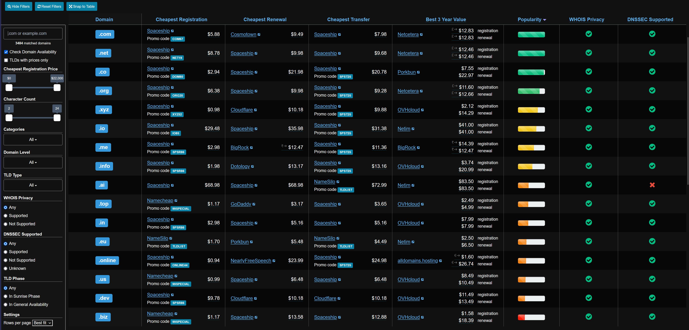
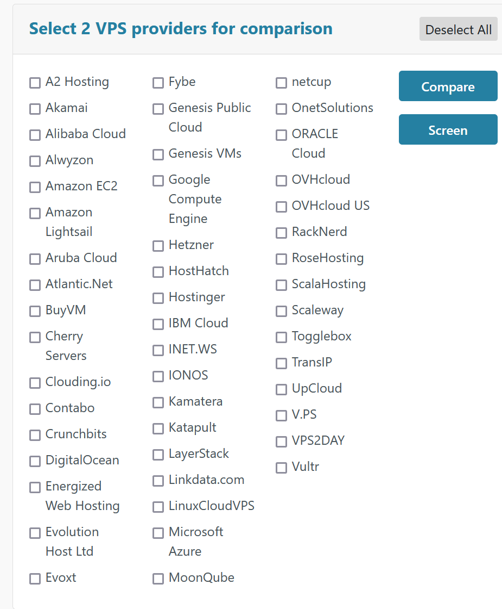
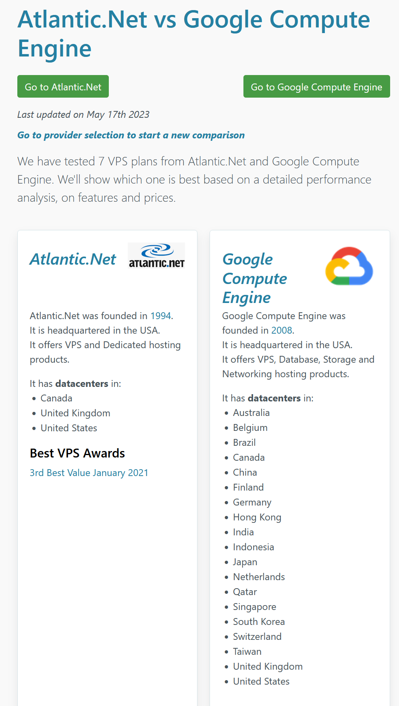
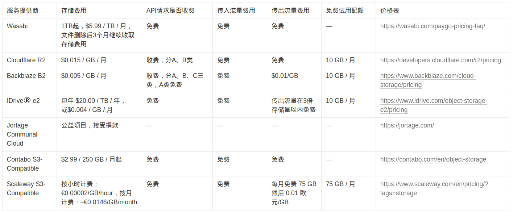

# 前言

目前已经有很多blog讲解过如何搭建一个长毛象站点，这篇blog的目的是从财务的角度给有计划独立建站的友友做成本参考，判断目前的财务健康状况是否可以支持长期运营一个Mastodon站点。

# TLDR

在不考虑人工的时间成本、学习成本、搭建成功后的运营成本，仅计算需要支付金钱的项目，同时最低限度保持100以下用户可用的前提下，搭建长毛象站点需要付费的项目有：
- 域名: 10 - 15 USD/年, 0.8 - 1.3 USD/月
- VPS: 60 - 120 USD/年，5 - 10 USD/月
- Email服务: 0 （可选）
- 对象储存: 0 （可选）
- CDN: 0 (可选)
总计 70 - 135 USD/年, 5.8 - 11.3 USD/月 (508 - 980 RMB/年, 42 - 82 RMB/月)

# 域名

域名是服务器地址的别名，其它服务器会通过域名和你的服务器交流。

一个可购买续费的域名由顶级域Top-level Domain（TLD，如 .xyz .homes .org .com）和主域名 Main Domain Name (比如example.com 中的example) 组成。大部分顶级域由国家机构管理（比如国家代码类 .ci .tv）以及[ICANN](https://en.wikipedia.org/wiki/ICANN)授权的机构管理。我们提到的注册域名一般指注册主域名+顶级域，如 example.com，这意味着在这个域名下你可以拥有任意数量的子域名 subdomain，比如 mastodon.example.com, blog.example.com。

域名的续费模型是按年续费，通常第一年会有折扣，从第二年开始按正常价格续费。普通的域名每年的续费费用为十几美元左右。

有很多大同小异的商业公司提供注册服务。可以使用比价网站[TLD-LIST](https://tld-list.com/)来对比首年续费和后期续费综合来看哪家注册商最划算。

注册商举例：[Netcetera](https://tld-list.com/go/netcetera/com) [Porkbun](https://tld-list.com/go/porkbun/co) [BigRock](https://tld-list.com/go/bigrock/me)

在注册域名时要注意的一点是一定要确认域名是否包括WHOIS Privacy服务（保护注册人的个人信息不被泄露，大部分注册商会免费提供）以及此项服务是否收费。

# VPS (Virtual Private Server / 服务器)

Mastodon官方没有提供推荐的server specifications。

以我个人的经验来看100人以下的实例，使用4vCores和4GiB的RAM会勉强够用，如果再低的话compile Mastodon的assets时可能会遇到内存不足的问题。

硬盘大小也是需要考虑的项目，如果你的嘟文和媒体文件都打算存储在本地。推荐选择至少有50GiB硬盘的plan。

Mastodon和其相应的组件(Redis, Elastic Search)对内存非常渴求，如果想要更快的相应速度，或者想要开启全文搜索服务，则需要相应增加内存的配比 (比如到8GiB)。

价格便宜、速度快、稳定性是选购VPS的不可能三角，可以使用[VPSBenchmarks](https://www.vpsbenchmarks.com/compare)网站来对比这三项。

> 出于安全性考虑，请尽量不要选用国内提供商如阿里云、腾讯云等。

VPS提供商举例: [Contabo](https://contabo.com/en/) [Hetzner](https://www.hetzner.com/) [Alwyzon](https://www.alwyzon.com/en)

# Email服务 （可选）

> 标记可选的原因是如果不打算开放注册以及不需要邮件提醒的话可以略过邮件这一项

发送注册确认邮件、IP地址更改、找回密码、发送Moderation处理报告都需要用到Email服务。

我正在使用的[Mailgun](https://www.mailgun.com/)有一个免费Plan可以支持每月发送1000封邮件，对于中小实例是完全够用的。

# 对象储存 （可选）

> 标记可选的原因是人数较少实例可能可以运营很长时间才需要考虑启用对象储存

媒体文件 - 包括图片、音频和视频将占到服务器存储的绝大部分，使用对象存储将很好地scale这部分存储。

我目前正在使用的[idrive e2](https://www.idrive.com/object-storage-e2/)应该是目前最便宜的，只需0.004USD/GiB/月。

> (引用自 https://paste.o3o.studio/)请注意，每个服务提供商都有自己的定价模型和费用结构，其中一些提供免费试用配额或特定限制。为了获取准确和最新的信息，请在服务提供商的官方网站上查看详细信息和条款。

| 服务提供商 | 存储费用 | API请求是否收费 | 传入流量费用 | 传出流量费用 | 免费试用配额 | 价格表 |
| --- | --- | --- | --- | --- | --- | --- |
| Wasabi | 1TB起，$5.99 / TB / 月，文件删除后3个月继续收取存储费用 | 免费 | 免费 | 免费 | — | https://wasabi.com/paygo-pricing-faq/ |
| Cloudflare R2 | $0.015 / GB / 月 | 收费，分A、B类 | 免费 | 免费 | 10 GB / 月 | https://developers.cloudflare.com/r2/pricing |
| Backblaze B2 | $0.005 / GB / 月 | 收费，分A、B、C三类，A类免费 | 免费 | $0.01/GB | 10 GB / 月 | https://www.backblaze.com/cloud-storage/pricing |
| IDrive® e2 | 包年 $20.00 / TB / 年，
或$0.004 / GB / 月 | 免费 | 免费 | 传出流量在3倍存储量以内免费 | 10 GB / 月 | https://www.idrive.com/object-storage-e2/pricing |
| Jortage Communal Cloud | 公益项目，接受捐款 | — | — | — | — | https://jortage.com/ |
| Contabo S3-Compatible | $2.99 / 250 GB / 月起 | 免费 | 免费 | 免费 | — | https://contabo.com/en/object-storage |
| Scaleway S3-Compatible | 按小时计费：€0.00002/GB/hour，按月计费：~€0.0146/GB/month | 免费 | 免费 | 每月免费 75 GB
然后 0.01 欧元/GB | 75 GB / 月 | https://www.scaleway.com/en/pricing/?tags=storage |

[source](https://o3o.ca/@salt/110745017807441769) by salt@o3o.ca

# CDN (可选)

你可以将自己地域名托管给CDN以获得更好的服务并且隐藏自己服务器的真实地址。CDN会cache你网站的内容和媒体文件并向地理位置最近的用户分发而不需要每次都请求你的服务器。

目前最广泛使用的CDN提供商是[CloudFlare](https://www.cloudflare.com/)，它们的免费plan也足够使用。