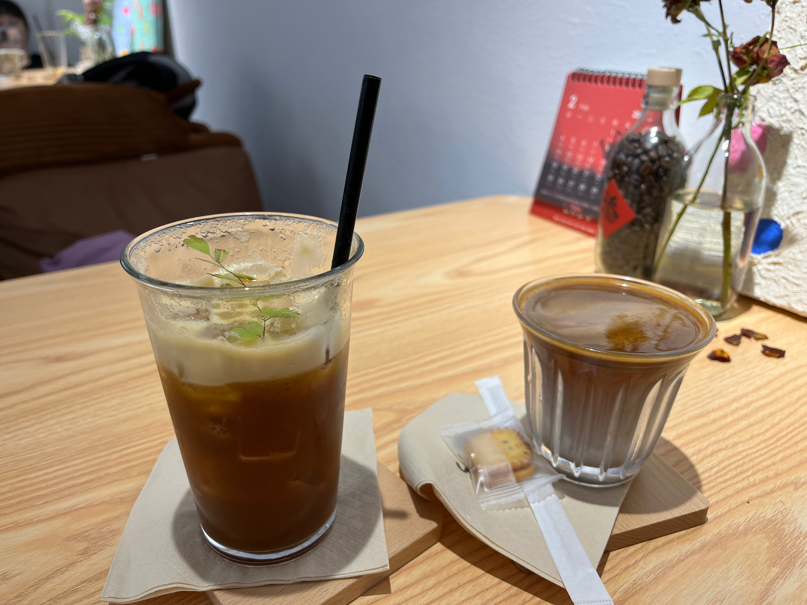
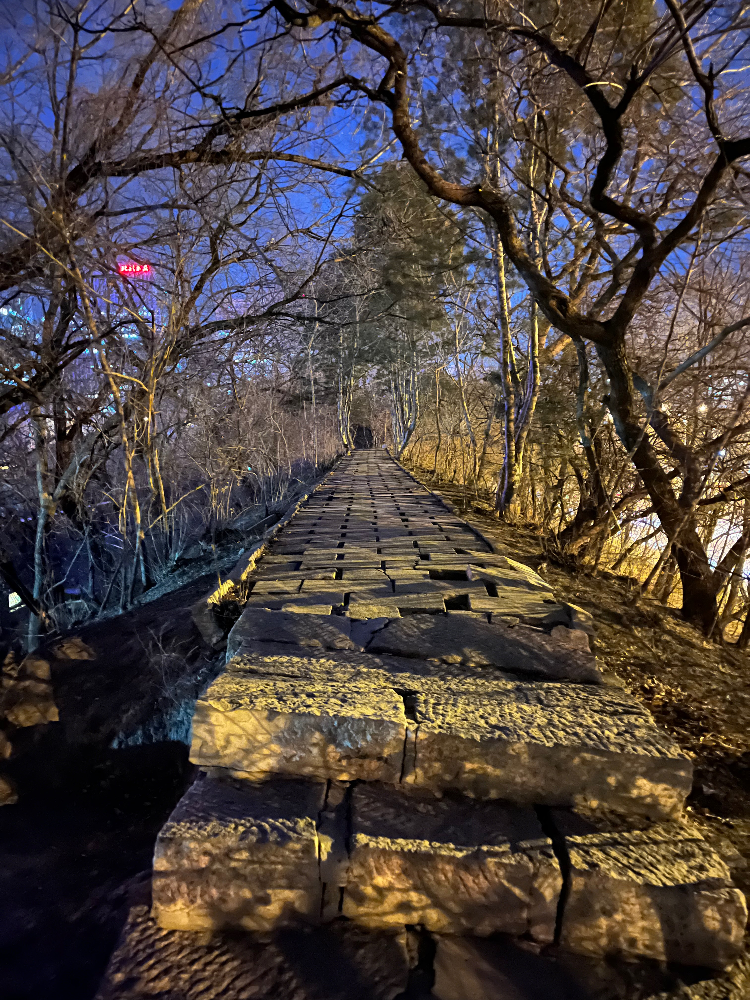

第一次写每月的简报，因为自己的记性不好，想有痕迹地存在蓝色的荒原。

---

《时间之间》 - 后海大鲨鱼


---

## Reading

读过 叫魂 🌕🌕🌕🌕🌗

“当国家清剿异己时，他们便会抓住这偶尔出现的机会攫取这种自由飘浮的社会权力。”
眼睛里看到的是弘历和叫魂，脑子里全部是毛泽东和他的大革命们，以及更新近的习近平和他的大清零，昏庸、好大喜功、盲目自信远胜弘历。
对“盛世”的称法早已祛魅并感到恶心，最近却更多地在官方宣传中看到。
“事件”是官僚们上升的齿轮，在大清零时亦是如此。

“是否就是这个事件煽起了民间对于石匠叫魂的恐惧？军机大臣们不能作出确定的回答。但慈相寺事件证实了他们的一种怀疑：所谓的“叫魂”妖术只是产生于无知又滋长于忌恨的一个幽灵。这不过是奸刁之徒利用民间恐惧逞其私欲的又一个例子。无论如何，吴石匠是没有任何责任的；他和巨成及其他和尚、乞丐计兆美、农夫沈士良等人一起被遣回乡里释放。至此，本书故事中最初出现的那些角色——既包括受害者也包括施害者——终于都如释重负地退出了历史的记录。”

https://neodb.social/@horaceyoung@neodb.social/posts/285706689512940376/

## Film

看了《热辣滚烫》

比想象中要好，贾玲好可爱一人。雷佳音不管是长相身材（太老了）还是行为方式（街边随地大小便令人不适）完全不如让另一个健身教练来演（他是不是第一个在贺岁档说大环境不景气台词的）。健身镜头混剪和最后的拳击赛很打动人。虽然地点在一个叫襄江的地方但是所有人都操着东北口。贾玲好惨除了后一个教练和沙溢就没遇到过什么好人。

https://neodb.social/@horaceyoung@neodb.social/posts/279899443478796064/

## Life

### Caturday

家里的猫，这个月带可怜的小家伙去做了绝育，他有隐睾担心他之后会有得睾丸癌的风险。

.jpeg>)

### 上海

和 🦄 去了上海，体验了很多朋友推荐的餐厅，还去看了偶像的年会（？）

我们在这家法餐吃了三份餐前面包，他们自己用酱油和黄油配的酱料很好吃。

去芥末wasabi试了日料自助，没有想象的好，虾的刺身没办法吃很多

上海博物馆有一个三星堆特展，虽然导语充斥着CCP和某位北京普信男士的污染，展品本身还是不错的

.jpeg>)
.jpeg>)

### 西安

### 沈阳

辽博的展品种类丰富，常设展的展品就可以参观很长时间，临时展的设置也很用心

### Omakase

在上海第一次尝试了Omakase，整体体验是好的。

.jpeg>)

.jpeg>)

### 新年

今天是COVID之后第一次回家过年，好久没有放炮放烟花了，大家心照不宣地没有在意喇叭里不停播放的禁令。

### 年夜饭们

### 北京

.jpeg>)

