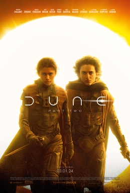
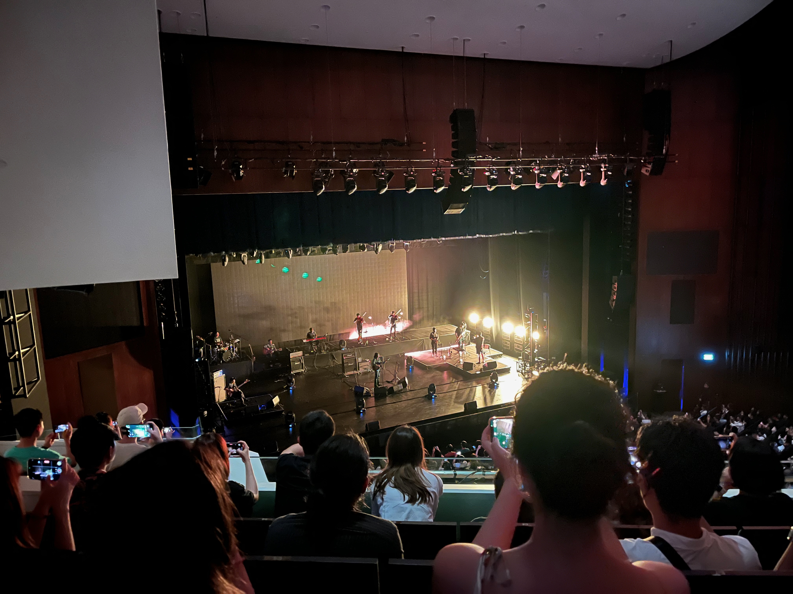
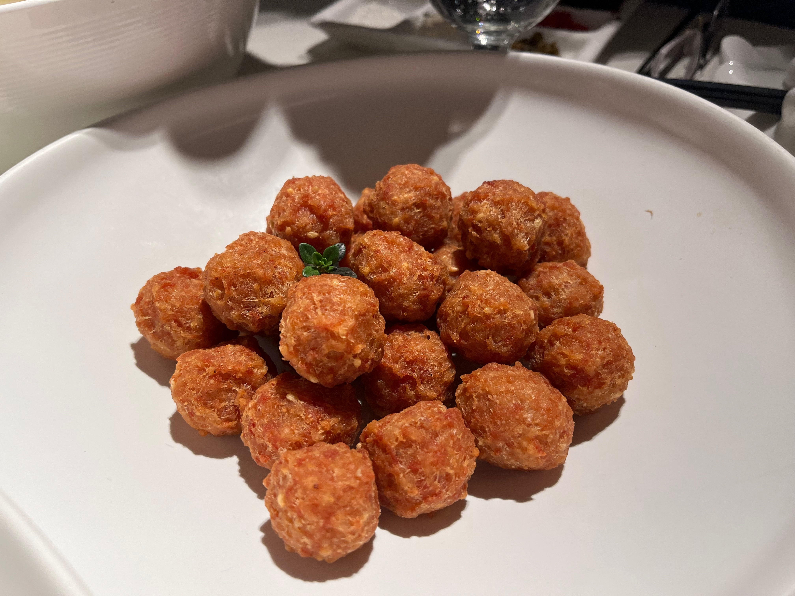

《相信》 - 布偶乐队


---

## Reading

在读 The Hundred Years' War on Palestine 🌕🌕🌕🌗🌑

读了大概1/3，对早期zionism得逞的原因和殖民帝国们一手造成的今日悲剧有了更多了解。作者的行文不算好读，视角比较偏精英阶层。巴勒斯坦人一步一步失去了自己的土地、祖产和自由，在Zionist和他们的支持者的支持下。

https://neodb.social/@horaceyoung@neodb.social/posts/309135264181864120/

## Film

看过《Dune: Part II》🌕🌕🌕🌗🌑

没有一点chemistry真的很难让人相信他们在谈恋爱。执行任务谈恋爱，发射导弹谈恋爱，登上沙丘谈恋爱。哈肯能家族致力于解决自己星球人口过剩的问题，家族传统过生日的时候把自己当角斗士给大家助助兴。揉了好多东西 - 阿拉伯的劳伦斯、海湾战争、过于伊斯兰即视感的宗教。虽然很危险但是我作为皇帝就是要亲自过来把你的输氧管拔了。充当背景板的The great houses感觉谁都能拿来放进自己的政治阴谋里。导演非常高效的解决了所有带不到第三部里的角色。男人太多了，满屏男人。

https://neodb.social/@horaceyoung@neodb.social/posts/293297207362352016/

## Life

### 演出

万青来新加坡演出啦，现场效果超好！

### 吃吃吃

吃了两次四季民福，好评，出品很稳定质量也不错，除了烤鸭之外还可以推荐干炸丸子、麻婆豆腐和巧拌豆苗。

## 剪报

联邦宇宙的星尘

- [战勇手书](https://www.bilibili.com/video/BV1LC411W7GX) 好像是很有意思的作品呢
- BDSM相关: [1](https://m.cmx.im/@yukimomo/111967744203936724) [2](https://forum-lucifer.com/@Michael/111981071503921798)
- In the Camps, 簡中譯本叫[《營中紀事》](https://chuangcn.org/books/%E8%90%A5%E4%B8%AD%E7%BA%AA%E4%BA%8B/)

- Waiting to Be Arrested at Night

- Figure Drawing

- ['More than “criminal”: The importance of context and detail in reporting on drugs'](https://www.wethecitizens.net/more-than-criminal-the-importance-of-context-and-detail/)
-  滔滔生活

- MADK

- Palestinian Identity

- The Hundred Years' War on Palestine

- ['Ace Week'](https://alive.bar/@irisinstrangeland/109229227834632118)
- 罔两问景：酷儿阅读攻略

- ['印度神话背景小说'](https://m.otter.homes/@anywaythewindblows/111919330616513195)
- Charlotte Gainsbourg
- ['喜剧推荐'](https://alive.bar/@zarathustra/111895039391772082)
- The Invention of Tradition

- The Nurture Assumption : Why Children Turn Out the Way They Do

