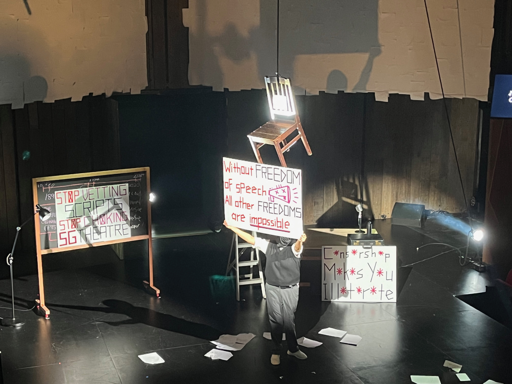
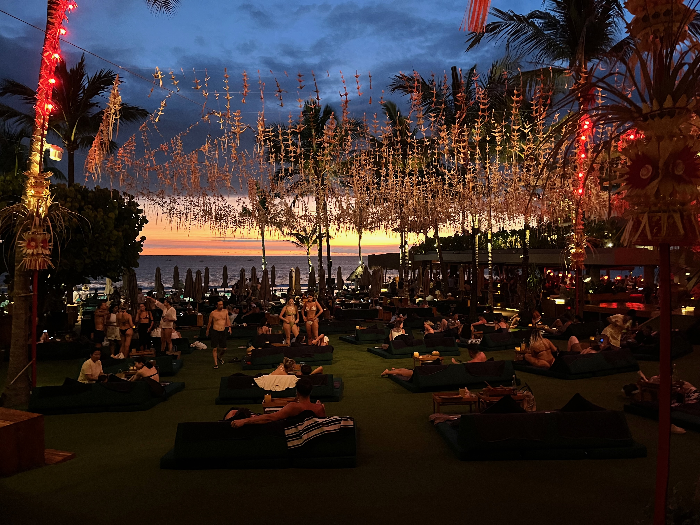

《相信》 - 布偶乐队


---

## Reading

在读 The Hundred Years' War on Palestine 🌕🌕🌕🌗🌑

读了大概1/3，对早期zionism得逞的原因和殖民帝国们一手造成的今日悲剧有了更多了解。作者的行文不算好读，视角比较偏精英阶层。巴勒斯坦人一步一步失去了自己的土地、祖产和自由，在Zionist和他们的支持者的支持下。

https://neodb.social/@horaceyoung@neodb.social/posts/309135264181864120/

## Film

看过《Dune: Part II》🌕🌕🌕🌗🌑

没有一点chemistry真的很难让人相信他们在谈恋爱。执行任务谈恋爱，发射导弹谈恋爱，登上沙丘谈恋爱。哈肯能家族致力于解决自己星球人口过剩的问题，家族传统过生日的时候把自己当角斗士给大家助助兴。揉了好多东西 - 阿拉伯的劳伦斯、海湾战争、过于伊斯兰即视感的宗教。虽然很危险但是我作为皇帝就是要亲自过来把你的输氧管拔了。充当背景板的The great houses感觉谁都能拿来放进自己的政治阴谋里。导演非常高效的解决了所有带不到第三部里的角色。男人太多了，满屏男人。

https://neodb.social/@horaceyoung@neodb.social/posts/293297207362352016/

## Life

### 演出

万青来新加坡演出啦，现场效果超好！

三月八号在livehouse遇到了宝贝乐队布偶，之后可能在Spotify上循环了无数次她们的专辑，还买了实体的专辑和T-恤。好喜欢她们疯疯的风格。

太白也很喜欢，四月刚好又去看了一次他们

Miss.Mix 贝斯手很酷

新加坡审查制度主题的戏剧，感同身受。

### 吃吃吃

吃了两次四季民福，好评，出品很稳定质量也不错，除了烤鸭之外还可以推荐干炸丸子、麻婆豆腐和巧拌豆苗。贝勒烤肉看上去还不错但是是一次做很多的那种放久了很难吃。

.jpeg)
庆丰包子铺，巨雷无比，非常贵而且包子皮厚馅薄干巴没汁水。

河沿肉饼，中规中矩的小吃店，价格还算便宜。

北新桥卤煮，中规中矩，喜欢内脏的可能会打更高分数。

Johor Bahru的烧烤海鲜，绝赞。

新柔长堤

看起来很好吃

Bali Fat Chow的猪排饭和海鲜炒饭

### 博物馆的一些老东西

这个太可爱了。。。

## Life

第一次在这种barber shop剪头发，体验就是非常快。没有剃须下次试试。

北京给我的感觉是一个为了掩饰其荒谬而不得不用层层铁幕遮掩的笼子。

什刹海

一些想要被擦去的记忆，就像座位上social distancing的胶带痕迹一样难以抹去。

大石兽胡同

Bali Mt. Batur的风景，我们上去的时候还有火山的水蒸气。

Bali的beach club。

## 剪报

联邦宇宙的星尘

- 唐宋传奇小说集 https://m.cmx.im/@ShibaMaster/112034220418966161
- 關於南非指控以色列政府的種族屠殺罪行報告的cheatsheet https://bgme.me/@DerSteppenwolfjj/111737216883570240
- 音乐推荐 https://o3o.ca/@nellieeeee/112077383731757472
- 《科学碰撞“性”》 https://go5.dev/@Gnpink/107433103719021438
- 《十个词汇里的中国》 https://alive.bar/@fakefestival/111274852930525512
- 《在台湾发现历史》 https://alive.bar/@satodiya/112156727767530383
- 压缩现代性下的韩国 https://social.kryta.app/@ppp/112239020576317921
- 洞石火，玩了开头 https://ramen-fsm.eu.org/@aminecrime/112253470111082625
- 奇愈地下城 https://bgme.me/@Fukufukuro/112281787773050445
- 享受这间餐厅吧 https://mastodon.social/@momijino2/112332200095534119